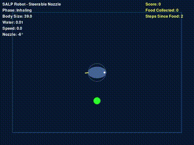

# GRASP Lab SALP Robot Simulation

Bio-inspired soft underwater robot simulation based on research from the University of Pennsylvania Sung Robotics Lab. This project implements SALP (Salp-inspired Approach to Low-energy Propulsion) robots in a Gymnasium environment for reinforcement learning research.

## 🚀 Quick Start

**Want to see it in action right now?**

```bash
# Watch a trained AI agent control the SALP robot
python quickstart/watch_agent.py

# Or try manual control to understand the physics
python scripts/utilities/salp_robot.py
```

📖 **[Full Quick Start Guide](quickstart/README.md)** - Get started in 60 seconds!

---

## Overview

This repository contains implementations of bio-inspired underwater robots that mimic the locomotion of marine salps - barrel-shaped invertebrates that swim via jet propulsion through rhythmic body contractions and expansions.

## 🎬 Demo Videos

**Watch our AI-trained SALP robot in action!** 

### Single Target Navigation (Long-Horizon)
*5000 timesteps of continuous navigation with respawning food target*

<div align="center">
  
</div>

**Performance:** 6 food items collected, 0 collisions over 5000 steps

### Multi-Target Environment
*Target-rich environment demonstration*

<div align="center">
  
</div>

## Features

### SALP Robot (`salp_robot.py`)
- **Slow, realistic breathing cycles** (2-3 seconds per phase)
- **Hold-to-inhale control scheme** for natural underwater movement
- **Steerable rear nozzle** (not body rotation) for directional control
- **Morphing body dynamics** with ellipsoid-to-sphere transitions
- **Realistic underwater physics** with momentum and drag
- **Enhanced propulsion moment physics** for realistic turning behavior

## Research Background

Based on research from the University of Pennsylvania Sung Robotics Lab:
- **Swimming Speed**: ~6.7 cm/s (0.2 body lengths/s)
- **Multi-Robot Benefits**: 9% velocity increase, 16% acceleration boost when coordinated
- **Energy Efficiency**: Cost of transport ~2.0
- **Bidirectional**: Forward and reverse propulsion possible

See `SALP_RESEARCH.md` for detailed research references and implementation notes.

## Installation

### Option 1: Install as a Package (Recommended)
```bash
pip install -e .
```

### Option 2: Install Dependencies Only
```bash
pip install -r requirements.txt
```

## Usage

### 🎬 Watch Trained Agents (Quickest!)

```bash
# Auto-detect and watch your best trained model
python quickstart/watch_agent.py

# List all available models
python quickstart/list_models.py

# Manual control (understand the physics)
python quickstart/examples/interactive_control.py
```

See **[quickstart/README.md](quickstart/README.md)** for complete documentation.

### 🏋️ Train New Agents

```bash
# Interactive training
python examples/demo.py train

# Continuous visual training
python examples/demo.py train --continuous
```

### 🎮 Manual Control Demo

```bash
python scripts/utilities/salp_robot.py
```

**Controls:**
- **HOLD SPACE**: Inhale water (slow contraction)
- **RELEASE SPACE**: Exhale water (slow expansion + thrust)
- **←/→ Arrow Keys**: Steer rear nozzle left/right
- **ESC**: Quit

## Gymnasium Environment

The SALP robot is implemented as a Gymnasium environment and can be used for reinforcement learning research:

```python
import gymnasium as gym
from salp.environments import SalpSnakeEnv

# Create environment
env = SalpSnakeEnv(render_mode="human")
observation, info = env.reset()

# Run simulation
for _ in range(1000):
    action = env.action_space.sample()  # Random action
    observation, reward, done, truncated, info = env.step(action)
    env.render()
    
    if done or truncated:
        observation, info = env.reset()

env.close()
```

## Action and Observation Spaces

### SALP Robot
- **Action Space**: `[inhale_control (0/1), nozzle_direction (-1 to 1)]`
- **Observation Space**: `[pos_x, pos_y, vel_x, vel_y, body_angle, angular_vel, body_size, breathing_phase, water_volume, nozzle_angle]`

## Key Implementation Features

### Breathing Cycle Mechanics
1. **Rest Phase**: Ellipsoid shape (natural resting state)
2. **Inhaling Phase**: Transition from ellipsoid to sphere (filling with water)
3. **Exhaling Phase**: Sphere back to ellipsoid (expelling water + thrust)

### Physics Simulation
- **Constant Surface Area**: Maintains realistic body volume during morphing
- **Underwater Drag**: Realistic water resistance and momentum
- **Thrust Vectoring**: Angled nozzle creates both forward thrust and turning moments
- **Wall Bouncing**: Realistic collision with tank boundaries

## Research Applications

This simulation is designed for:
- **Reinforcement Learning**: Training agents to learn optimal swimming patterns
- **Multi-Agent Coordination**: Studying salp chain formations
- **Bio-Inspired Robotics**: Understanding underwater propulsion mechanisms
- **Control Systems**: Developing efficient underwater vehicle control strategies

## Project Structure

```
GRASP_LAB_SALP/
├── quickstart/            # 🚀 Quick-start scripts (START HERE!)
│   ├── README.md          # Quick-start guide
│   ├── watch_agent.py     # Watch trained models
│   ├── list_models.py     # List available models
│   └── examples/          # Zero-config examples
├── src/salp/              # Main package (installable)
│   ├── agents/            # Agent implementations (SAC, GAIL, etc.)
│   ├── environments/      # Gymnasium environments
│   ├── training/          # Training utilities
│   ├── core/              # Core base classes
│   └── config/            # Configuration
├── scripts/               # Executable scripts
│   ├── training/          # Training scripts
│   ├── testing/           # Test scripts
│   ├── collection/        # Demo collection scripts
│   └── utilities/         # Utility scripts (video conversion, visualizations)
├── examples/              # Usage examples
├── data/                  # Data files
│   ├── expert_demos/      # Expert demonstrations
│   ├── models/            # Saved models
│   └── logs/              # Training logs
├── assets/                # Media files
│   ├── images/            # PNG diagrams
│   └── videos/            # Video files
├── tests/                 # Test files
└── docs/                  # Documentation
```

## Research References

- **"Origami-inspired robot that swims via jet propulsion"** (2021) - IEEE Robotics and Automation Letters
- **"Effect of Jet Coordination on Underwater Propulsion with the Multi-Robot SALP System"** (2025)
- **"Drag coefficient characterization of the origami magic ball"** (2023)

See `docs/SALP_RESEARCH.md` for complete research documentation and implementation notes.

## Contributing

This project is part of ongoing research into bio-inspired underwater robotics. Contributions and improvements are welcome.

## License

This project is developed for research purposes. Please cite the original research papers when using this code in academic work.

## Contact

For questions about the research or implementation, please refer to the University of Pennsylvania Sung Robotics Lab publications and resources.
